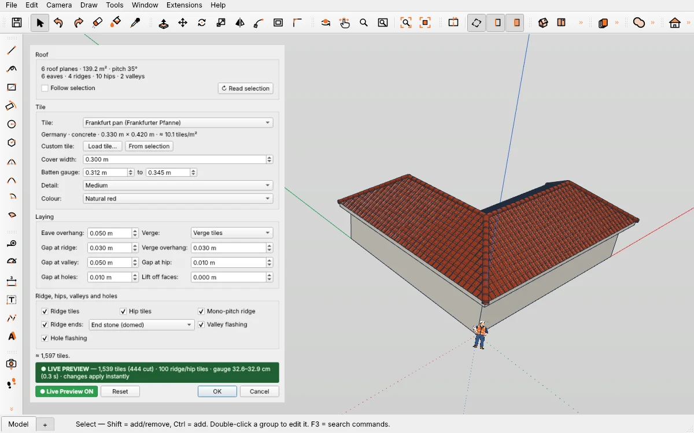
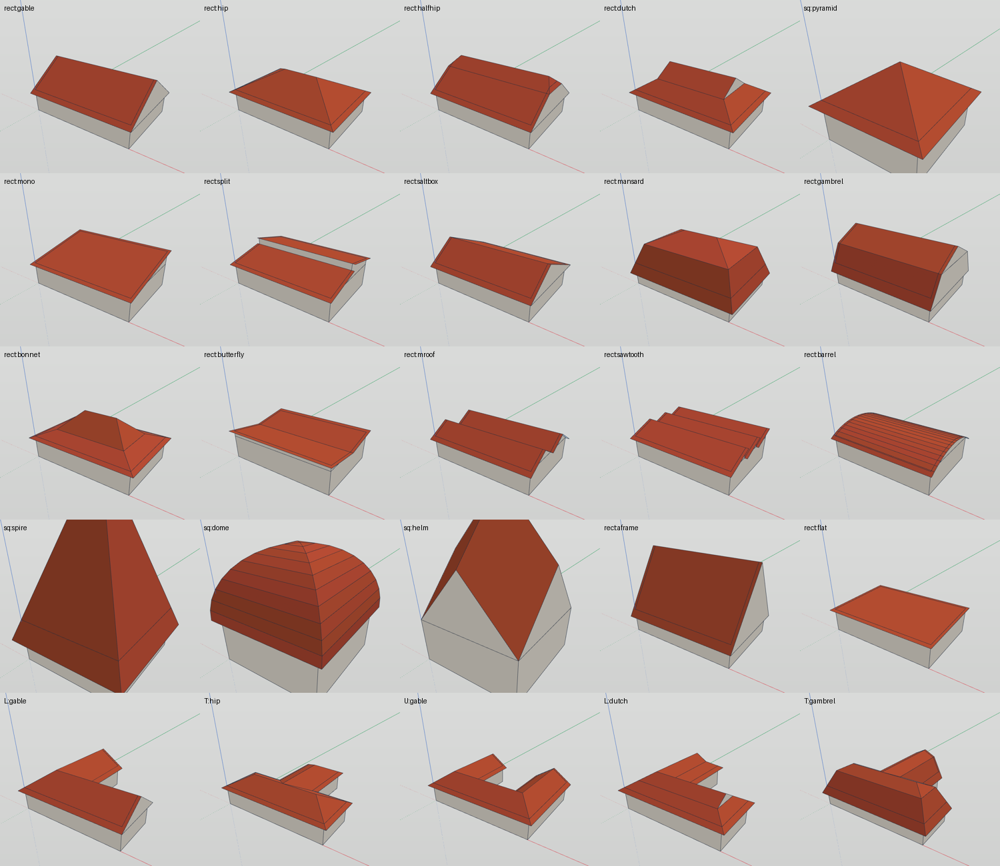
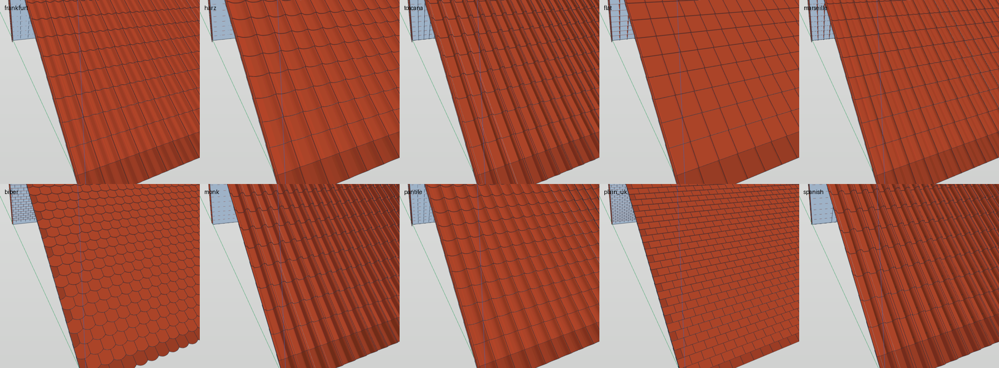
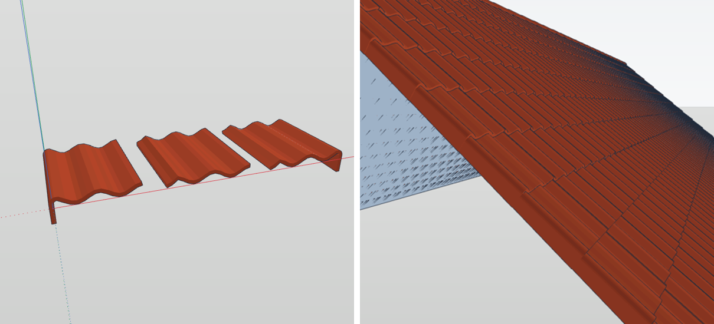
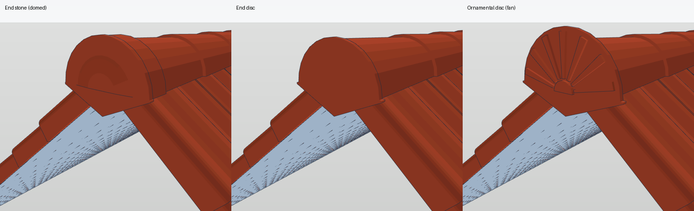
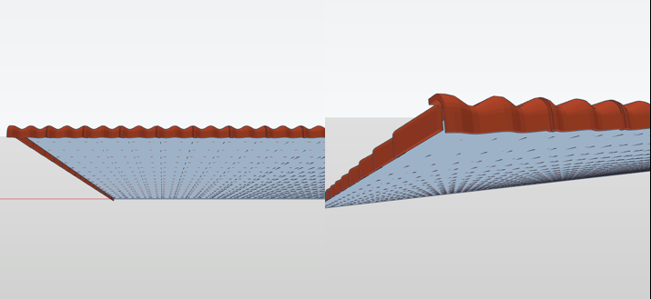
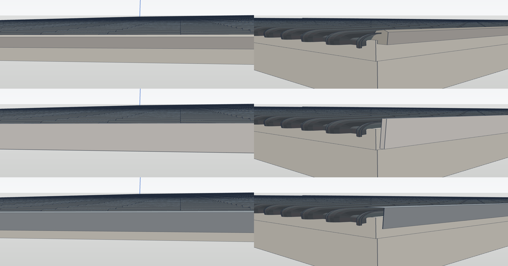

# Roof Tiles — Dächer bauen und mit echten 3D-Ziegeln eindecken in IngeTrazo

Zwei Werkzeuge in einem Plugin:

1. **Create Roof…** baut ein Dach auf einem Grundriss: 20 Dachformen aus Deutschland, Europa, Großbritannien, den USA und Asien.
2. **Cover Roof…** deckt beliebige Dachflächen mit echten 3D-Dachziegeln ein, mit Ortgangziegeln, Firstziegeln, Grat- und Firstenden.

## Installation
`roof_tile_tool.py` aus dem [neuesten Release](../../releases/latest) laden, in den Plugin-Ordner kopieren (Extensions ▸ Open plugins folder, unter Windows `%APPDATA%\ingetrazo\plugins`) und IngeTrazo neu starten. Braucht IngeTrazo ≥ 0.5.7.

Zu finden unter **Extensions ▸ Roof Tiles**, im Rechtsklickmenü und in der Werkzeugleiste «Roof Tiles» (4 Icons).

## Create Roof…
Waagerechte Fläche (Oberkante der Wände) oder einen Baukörper (Gruppe) auswählen ▸ **Create Roof…**. Die Seiten des Grundrisses werden im Viewport nummeriert.

- Dachformen: Satteldach, Walmdach, Krüppelwalm, Fußwalm / Dutch gable / Irimoya, Zeltdach, Pultdach, versetztes Pultdach, Saltbox / Catslide, Mansardwalmdach, Mansarddach (Gambrel), Aufschiebling (Bonnet), Schmetterlingsdach, Doppelsatteldach (M-roof), Sheddach, Tonnendach, Turmhelm / Kegeldach, Kuppel, Rhombendach, A-Frame, Flachdach mit Gefälle.
- Satteldach, Walmdach und Verwandte funktionieren auf **jedem Grundriss** (L, T, U, schief …): Grate, Kehlen und Kreuzgiebel entstehen von selbst (gewichtetes Straight Skeleton). Die übrigen Formen werden auf den Grundriss zugeschnitten.
- **Gable sides**: automatisch oder per Liste; **Turn the ridge 90°** dreht den First.
- Je Form: **Pitch**, **Pitch 2**, **Starts at**, **Break height**, **Height step**, **Teeth**, **Eave side**, **Eave overhang**, **Gable overhang**, **Gable walls**, **Roof thickness** (geschlossene Dachplatte mit Stirnbrett).
- Nach dem Bauen wird jede Fläche geprüft und bei Bedarf nach außen gedreht.
- **Cover with tiles after OK** öffnet gleich danach Cover Roof…. **Edit Roof Shape…** ändert das Dach später; eine Eindeckung darauf wird automatisch neu verlegt.

## Cover Roof…
Dachflächen (oder die Dach-Gruppe) auswählen ▸ **Cover Roof…**. Traufe, First, Grat, Kehle, Ortgang, Pultfirst, Mansard-Knick und Löcher werden erkannt. Jede Neigung lässt sich eindecken.

- 10 Ziegel: Frankfurter Pfanne, Harzer Pfanne, Toscana, Flachdachpfanne, Marseiller, Biberschwanz, Mönch und Nonne, englische Pfanne, English plain tile, spanischer Ziegel — oder ein eigener Ziegel (.igz / .obj / Auswahl). Maße = typische Werte, keine Herstellerdaten.
- Lattweite und Deckbreite werden eingepasst, auch auf innere Ortgänge (die Stufe eines L).
- **Verge**: einteilige Ortgangziegel — oder bündig geschnitten und mit **Mörtelwulst**, **Windbrett** oder **Ortgangblech** abgeschlossen.
- Halbrunde Firstziegel; **Ridge ends** an den Firstenden und am Fuß jedes Grats (Gratanfänger): End stone (domed), End disc, Ornamental disc (fan).
- **Pultfirstziegel**: das Profil des Ziegels biegt über die Oberkante nach unten.
- Kehlblech (**Valley flashing**) und Eindeckrahmen um Dachfenster und Kamine (**Hole flashing**).
- Ganze Ziegel sind Instanzen, Randziegel echte Schnitte (manifold3d). Ein Undo-Schritt, Live Preview, **Edit Roof Tiles…**.

| | |
|---|---|
|  |  |
|  |  |

## Hinweis
Produktnamen dienen nur der Beschreibung der Ziegelform; das Plugin steht in keiner Verbindung zu einem Ziegelhersteller.

Lizenz GPL-3.0-or-later · Pesi, [pesi3d.de](https://pesi3d.de) — English: [README.md](README.md)
